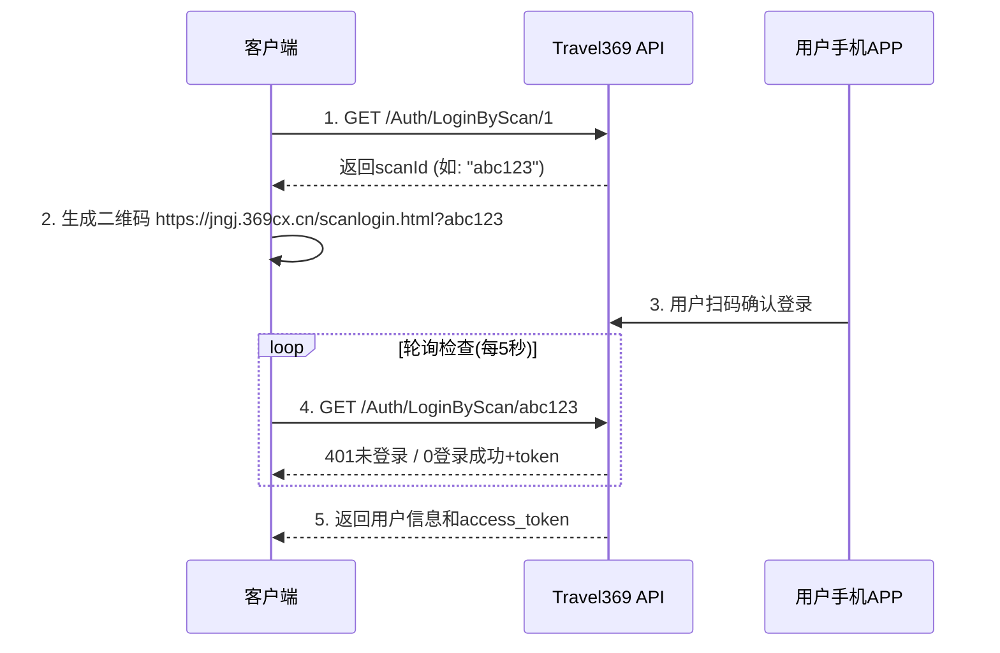
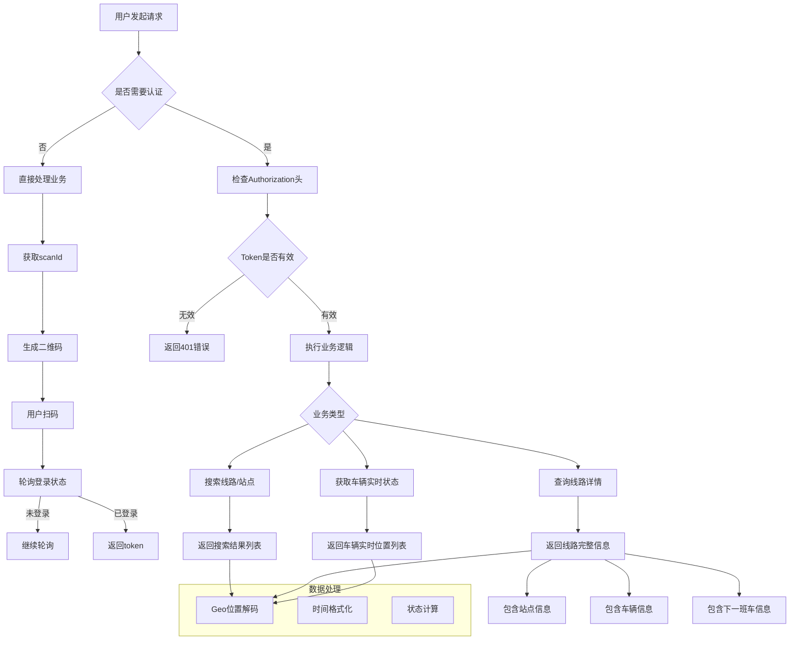
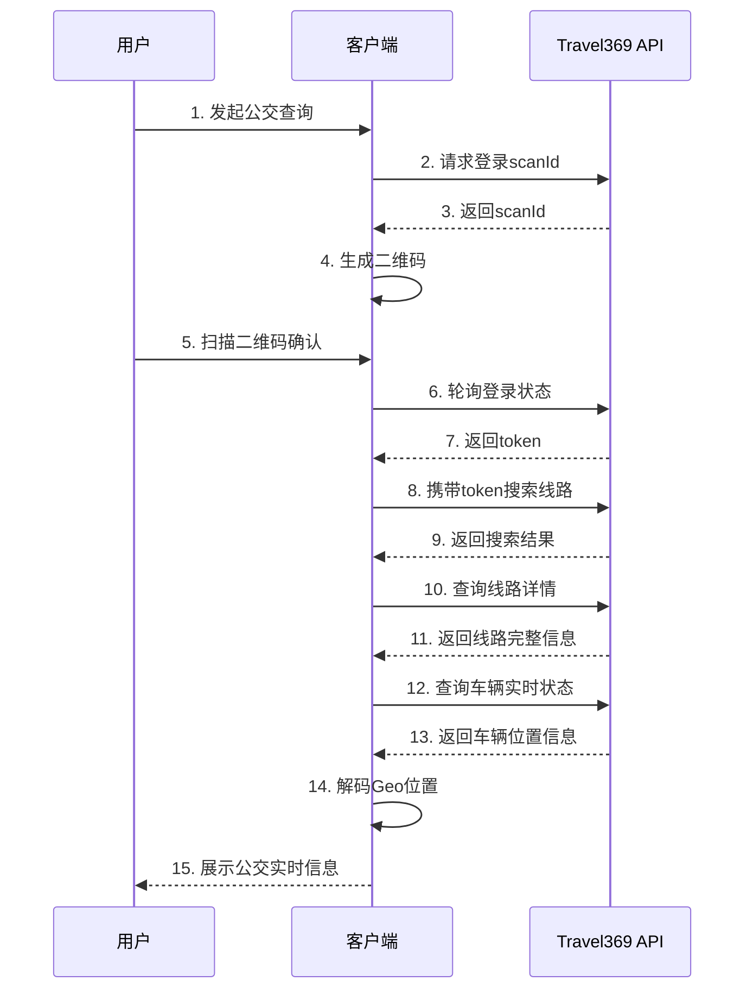

# Travel369 第三方API接口文档

## 概述

本文档描述Travel369公交出行平台对外提供的RESTful API接口规范，包括请求报文格式、响应数据结构以及各接口间的业务逻辑关系。

## 基础信息

**API域名**: `https://api.369cx.cn/v2/`  
**协议**: HTTPS  
**数据格式**: JSON  
**字符编码**: UTF-8  
**User-Agent**: `Mozilla/5.0 (Windows NT 10.0; Win64; x64) AppleWebKit/537.36`

---

## 认证体系

### 扫码登录流程



### 1. 获取登录凭证
**请求:**
```
GET https://api.369cx.cn/v2/Auth/LoginByScan/1
```

**响应(成功):**
```json
{
  "result": null,
  "status": {
    "code": 401,
    "msg": "abc123"  // scanId，用于生成二维码
  }
}
```

### 2. 轮询登录状态
**请求:**
```
GET https://api.369cx.cn/v2/Auth/LoginByScan/{scanId}
```

**响应(等待扫码):**
```json
{
  "result": null,
  "status": {
    "code": 401,
    "msg": "{scanId}"  // 与请求中的scanId相同表示等待扫码
  }
}
```

**响应(登录成功):**
```json
{
  "result": {
    "role": 1,
    "token": "eyJhbGciOiJIUzI1NiIsInR5cCI6IkpXVCJ9...",  // JWT Token
    "roles": "user",
    "nickName": "张三",
    "headUrl": "https://example.com/avatar.jpg",
    "phone": "138****8888",
    "uniqueId": "USER_001"
  },
  "status": {
    "code": 0,
    "msg": "success"
  }
}
```

### 3. 用户信息查询
**请求:**
```
GET https://api.369cx.cn/v2/api/AdminConsole/Info
Authorization: {token}
```

**响应:**
```json
{
  "result": {
    "userId": 12345,
    "userName": "张三",
    "email": "zhangsan@example.com",
    "createTime": "2023-01-01T00:00:00"
  },
  "status": {
    "code": 0,
    "msg": "success"
  }
}
```

---

## 业务接口

### 状态码说明

| 状态码 | 含义 | 说明 |
|--------|------|------|
| 0 | 成功 | 请求处理成功 |
| 401 | 认证失败 | Token无效或过期，需重新登录 |

---

## 核心业务API

### 1. 搜索接口

**接口地址:** `POST /Search`  
**功能:** 根据关键词搜索公交线路、站点等信息

**请求报文:**
```http
POST https://api.369cx.cn/v2/Search
Authorization: eyJhbGciOiJIUzI1NiIsInR5cCI6IkpXVCJ9...
Content-Type: application/json

{
  "keyword": "K93"
}
```

**响应报文:**
```json
{
  "result": {
    "tip": null,
    "result": [
      {
        "type": 1,
        "text1": "K93路",
        "text2": "火车站-汽车站",
        "text3": "运营中",
        "waitTime": 5,
        "nextBus": 12345,
        "guid": "LINE_1001",
        "tag": "主线",
        "img": "https://example.com/bus_icon.png"
      },
      {
        "type": 2,
        "text1": "火车站",
        "text2": "K93路途经此站",
        "text3": "距下站200米",
        "waitTime": 0,
        "nextBus": 0,
        "guid": "STATION_2001",
        "tag": "站点",
        "img": "https://example.com/station_icon.png"
      }
    ],
    "refresh": 1698765432
  },
  "status": {
    "code": 0,
    "msg": "success"
  }
}
```

**字段说明:**
- `type`: 结果类型 (1=线路, 2=站点)
- `text1`: 主标题
- `text2`: 副标题
- `text3`: 描述信息
- `waitTime`: 等待时间(分钟)
- `nextBus`: 下一班车ID
- `guid`: 唯一标识符
- `refresh`: 数据刷新时间戳

---

### 2. 线路实时信息接口

**接口地址:** `GET /Line/GetRealTimeLineInfo/{lineId}`  
**功能:** 获取指定线路的详细实时运营信息

**请求报文:**
```http
GET https://api.369cx.cn/v2/Line/GetRealTimeLineInfo/1001
Authorization: eyJhbGciOiJIUzI1NiIsInR5cCI6IkpXVCJ9...
```

**响应报文:**
```json
{
  "result": {
    "lineId": 1001,
    "name": "K93路",
    "backLineId": 1002,
    "startStationName": "火车站",
    "endStationName": "汽车站",
    "firstDepartureTime": "06:00",
    "lastDepartureTime": "22:00",
    "mainColor": "#FF5722",
    "operationType": "常规线路",
    "priceCalcType": "分段计价",
    "priceDiscountType": "普通卡9折",
    "publicTag": "市区线路",
    "searchPageImg": "https://example.com/line_img.jpg",
    "type": 1,
    "tagVersion": 20231001,
    "teamId": 101,
    "adBar": [
      {
        "name": "双节活动",
        "picUrl": "https://example.com/ad.jpg",
        "splashId": 10001,
        "targetUrl": "https://example.com/promotion",
        "type": 1
      }
    ],
    "nextBus": {
      "busId": 12345,
      "lineId": 1001,
      "name": "鲁A12345",
      "openAirCon": true,
      "planArrTime": "14:35:00",
      "planTime": "14:30:00",
      "quJianFlag": false,
      "startStation": "火车站",
      "endStation": "汽车站"
    },
    "busses": [
      {
        "busId": 12345,
        "name": "鲁A12345",
        "lineId": 1001,
        "stationNo": 5,
        "velocity": 25.6,
        "siteTime": 30,
        "openAirCon": true,
        "distance": 150,
        "geo": "ABCDEFG",
        "icon": "https://example.com/bus_icon.png",
        "ratio": 75,
        "angle": 180,
        "quJian": false
      }
    ],
    "stations": [
      {
        "congestions": [1, 2, 1],
        "corsTime": 120,
        "distance": 500,
        "polyline": "116.123,36.456;116.124,36.457",
        "stationNo": 1,
        "publicTag": "始发站",
        "road": "经十路",
        "cityId": 370100,
        "stationId": 2001,
        "name": "火车站",
        "subName": "",
        "englishName": "Railway Station",
        "compass": "北",
        "geo": "HIJKLMN",
        "type": 1
      }
    ]
  },
  "status": {
    "code": 0,
    "msg": "success"
  }
}
```

**关键字段说明:**
- `lineId`: 线路唯一标识
- `backLineId`: 返程线路ID
- `stationNo`: 当前站序号
- `velocity`: 实时速度(km/h)
- `geo`: 位置编码(7位字符串，需解码)
- `ratio`: 满载率(%)
- `angle`: 行驶方向角度
- `quJian`: 是否区间车

---

### 3. 公交车辆实时状态接口

**接口地址:** `GET /Bus/GetBussesByLineId/{lineId}`  
**功能:** 获取指定线路上所有运行中公交车辆的实时状态

**请求报文:**
```http
GET https://api.369cx.cn/v2/Bus/GetBussesByLineId/1001
Authorization: eyJhbGciOiJIUzI1NiIsInR5cCI6IkpXVCJ9...
```

**响应报文:**
```json
{
  "result": [
    {
      "busId": 12345,
      "name": "鲁A12345",
      "lineId": 1001,
      "stationNo": 8,
      "velocity": 18.5,
      "siteTime": 45,
      "openAirCon": true,
      "distance": 200,
      "geo": "OPQRSTU",
      "icon": "https://example.com/bus_running.png",
      "ratio": 68,
      "angle": 90,
      "quJian": false
    },
    {
      "busId": 12346,
      "name": "鲁A12346",
      "lineId": 1001,
      "stationNo": 3,
      "velocity": 0.0,
      "siteTime": 120,
      "openAirCon": false,
      "distance": 50,
      "geo": "VWXYZAB",
      "icon": "https://example.com/bus_stop.png",
      "ratio": 85,
      "angle": 270,
      "quJian": true
    }
  ],
  "status": {
    "code": 0,
    "msg": "success"
  }
}
```

**车辆状态判断:**
- `velocity > 0`: 运行中
- `velocity = 0` 且 `siteTime > 60`: 停站中
- `quJian = true`: 区间车(非全程运营)

---

## 地理位置编码规范

### Geo编码格式

Travel369使用专有的7字符位置编码系统，相关文件参考geo.js


---

## 业务逻辑关系图



## 接口调用时序

### 完整业务流程



## 错误处理规范

### 标准错误响应格式
```json
{
  "result": null,
  "status": {
    "code": 401,
    "msg": "认证失败，请重新登录"
  }
}
```

### 常见错误码
| 错误码 | 场景 | 建议处理方式 |
|--------|------|------------|
| 401 | Token无效/过期 | 引导用户重新登录 |
| 其他 | 系统异常 | 重试或提示服务暂时不可用 |

## 最佳实践建议

1. **Token管理**: 登录成功后妥善保存token，设置合理的过期检查机制
2. **轮询策略**: 登录轮询建议间隔5秒，避免过于频繁
3. **Geo解码**: 建议批量解码连续位置点以提升性能
4. **缓存策略**: 对于不常变动的数据(如线路基础信息)可适当缓存
5. **异常重试**: 网络异常时建议采用指数退避重试机制
